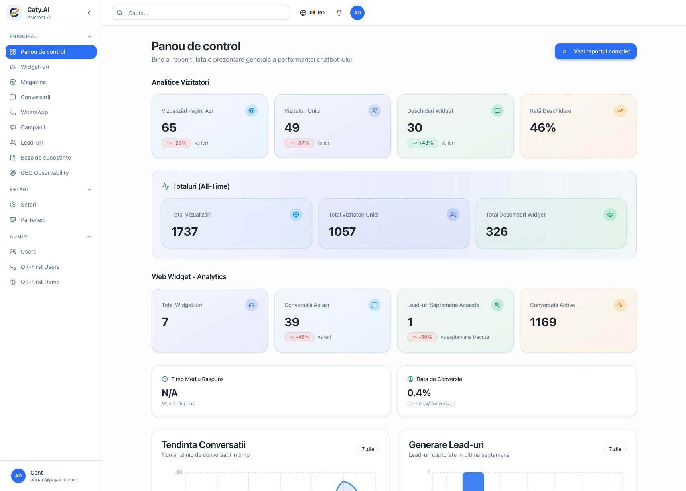
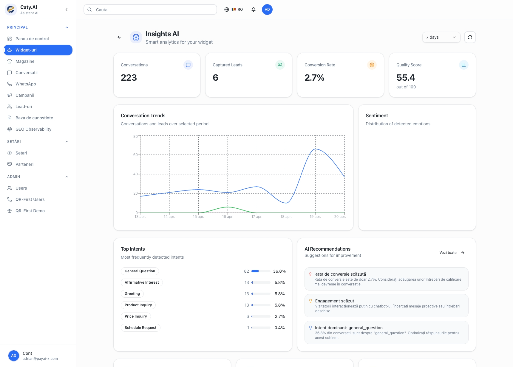
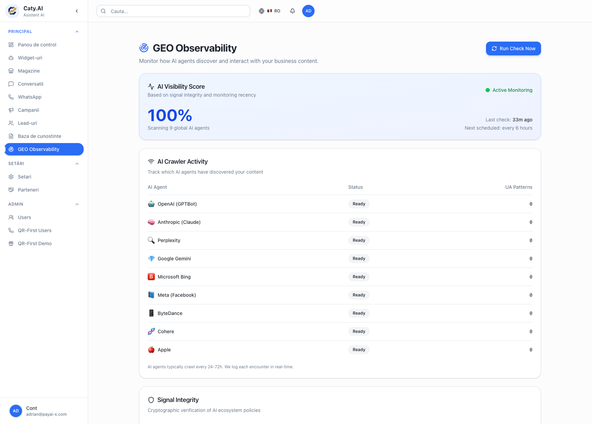

<p align="center">
  
</p>

<h1 align="center">CatyAI</h1>

<p align="center">
  <strong>Revenue & Performance Partner</strong><br>
  AI-powered customer engagement platform for e-commerce
</p>

<p align="center">
  <a href="https://catyai.io">Website</a> •
  <a href="https://docs.catyai.io">Documentation</a> •
  <a href="https://app.catyai.io">Dashboard</a>
</p>

---

## Live Platform (April 2026)

<p align="center">
  
</p>

<p align="center">
  
  
</p>

<p align="center">
  
</p>

**Production Stats:**
- 1,737 Total Page Views
- 1,057 Unique Visitors
- 223 Conversations
- 9 AI Agents Monitored (100% Visibility Score)

---

## Overview

CatyAI is an enterprise-grade AI platform that helps businesses automate customer engagement, capture leads, and increase revenue through intelligent conversations.

### Key Features

- **AI Chat Widget** - Embeddable widget with knowledge base integration
- **Lead Capture** - Automatic contact extraction and CRM sync
- **WhatsApp Integration** - Unified experience across web and WhatsApp
- **Cart Recovery** - Automated abandoned cart recovery with gamification
- **Multi-language** - Support for 50+ languages with automatic detection
- **Analytics Dashboard** - Real-time conversation insights and metrics

## Quick Start

### Widget Installation

Add this snippet before `</body>` on your website:

```html
<script 
  src="https://cdn.catyai.io/widget.js" 
  data-widget-id="YOUR_WIDGET_ID"
  async>
</script>
```

### Configuration

```javascript
window.CatyAI = {
  widgetId: 'YOUR_WIDGET_ID',
  position: 'bottom-right',
  theme: 'light',
  language: 'auto'
};
```

## Documentation

Full documentation is available at [docs.catyai.io](https://docs.catyai.io):

- [Getting Started Guide](https://docs.catyai.io/guide/getting-started)
- [Widget Configuration](https://docs.catyai.io/guide/widget-configuration)
- [Knowledge Base Setup](https://docs.catyai.io/guide/knowledge-base)
- [API Reference](https://docs.catyai.io/api/)
- [WhatsApp Integration](https://docs.catyai.io/guide/whatsapp-integration)

## Tech Stack

- **Frontend:** React 18, TypeScript, Vite, TailwindCSS
- **Backend:** Node.js, Express, MongoDB
- **AI:** OpenAI GPT-4o-mini, Qdrant Vector DB
- **Infrastructure:** AWS (ECS, S3, CloudFront, DocumentDB)

## License

This project is dual-licensed:

- **AGPL-3.0** - For open source use
- **Enterprise License** - For commercial deployments

See [LICENSE](LICENSE) for details.

## Company

**PayAi-X FZE**  
Dubai, UAE

- Website: [catyai.io](https://catyai.io)
- Email: contact@payai-x.com
- Documentation: [docs.catyai.io](https://docs.catyai.io)

---

<p align="center">
  Made with ❤️ by PayAi-X FZE
</p>
